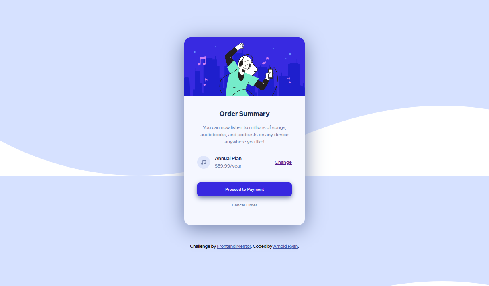

# Frontend Mentor - Order summary card solution

This is a solution to the [Order summary card challenge on Frontend Mentor](https://www.frontendmentor.io/challenges/order-summary-component-QlPmajDUj).

## Table of contents

- [Overview](#overview)
  - [The challenge](#the-challenge)
  - [Screenshot](#screenshot)
  - [Links](#links)
- [My process](#my-process)
  - [Built with](#built-with)
  - [What I learned](#what-i-learned)
  - [Continued development](#continued-development)
  - [Useful resources](#useful-resources)
- [Author](#author)

## Overview

### The challenge

Users should be able to:

- See hover states for interactive elements

### Screenshot

### Links

- Solution URL: [Github Code](https://github.com/arnold-ryan/order-summary-component-main)
- Live Site URL: [Live Site](https://arnold-order-summary-card.netlify.app/)

## My process

### Built with

- Semantic HTML5 markup
- CSS custom properties
- Flexbox
- Desktop-first workflow

### What I learned

- To make border radius on images you need to set overflow hidden on the parent container
- Making the hover effect of the button required the use of z-index and box-shadow

### Continued development

I'd like to continue learning about making different hover effects using box-shadow.

### Useful resources

- [MDN](https://developer.mozilla.org/en-US/docs/Web/CSS/box-shadow) - achieving hover effect using box-shadow
- [MDN](https://developer.mozilla.org/en-US/docs/Web/CSS/z-index) - placing components at different z-index positions

## Author

- Website - [Arnold Odhiambo](https://arnold-portfolio.netlify.app)
- Frontend Mentor - [@arnold-ryan](https://www.frontendmentor.io/profile/arnold-ryan
- LinkedIn - [Arnold Odhiambo](https://www.linkedin.com/in/arnold-odhiambo-dev/)
